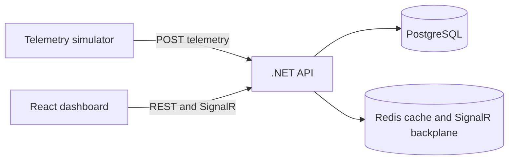

# Ops Dashboard

Real-time fleet operations dashboard demonstrating a .NET 8 API, PostgreSQL persistence, Redis caching and SignalR updates. A local simulator continuously sends fictional vehicle telemetry so the dashboard opens with useful live data.

## What This Demonstrates

- A layered .NET API with domain, application and infrastructure projects
- Batched telemetry ingestion and EF Core persistence
- Cached fleet summaries with PostgreSQL fallback
- Region-scoped SignalR updates with Redis as the backplane
- A React and TypeScript operator dashboard with vehicle history and alerts
- A reproducible local environment started entirely with Docker Compose

## Architecture



The simulator, API, dashboard and infrastructure are the complete local demo. No cloud account, Kubernetes cluster, message broker or manually installed database is required.

## Tech Stack

| Area | Technologies |
| --- | --- |
| Frontend | React, TypeScript, Vite, Recharts, SignalR client |
| Backend | .NET 8 Minimal APIs, EF Core, Npgsql, SignalR, Swagger |
| Infrastructure | PostgreSQL 16, Redis 7, Docker Compose |
| Verification | .NET tests and optional k6 load tests |

## Quick Start

### Requirements

- Git
- Docker Desktop with Docker Compose

### Run the demo

From the repository root:

```powershell
Copy-Item .env.example .env
docker compose up --build
```

The API applies the existing EF Core migrations automatically. Once the API is healthy, the simulator begins posting 50 vehicle readings every two seconds.

Open the dashboard at [http://localhost:5173](http://localhost:5173).

The first build can take a few minutes while Docker restores .NET and npm dependencies.

## Local URLs

| Resource | URL |
| --- | --- |
| Dashboard | [http://localhost:5173](http://localhost:5173) |
| API health | [http://localhost:5000/health](http://localhost:5000/health) |
| Swagger | [http://localhost:5000/swagger](http://localhost:5000/swagger) |
| PostgreSQL | `localhost:5432` |
| Redis | `localhost:6379` |

The API key is the demo value from `.env.example`. The frontend and simulator receive it automatically through Compose.

## Demo Workflow

1. Start Compose and wait for the API health check to pass.
2. Watch the simulator logs as it posts telemetry batches.
3. Open the dashboard to inspect fleet KPIs, live speed, regions and alerts.
4. Select a vehicle to inspect recent telemetry history.
5. Change the region or status filters and observe SignalR updates.

The simulator produces moving, idle and threshold-triggering readings. Data is fictional and exists only in the local Docker volumes.

## API

All `/api` routes require the `X-API-Key` header. Swagger is available locally without an additional setup step.

| Method | Route | Purpose |
| --- | --- | --- |
| `GET` | `/health` | API readiness check |
| `POST` | `/api/telemetry/batch` | Ingest up to 1,000 readings |
| `GET` | `/api/fleet/status` | Latest status for every vehicle |
| `GET` | `/api/fleet/{externalId}` | Vehicle history and alerts |
| `GET` | `/api/fleet/summary` | Cached fleet metrics |
| `GET` | `/api/alerts?limit=20` | Recent threshold alerts |
| `GET` | `/hubs/fleet` | SignalR hub |

## Configuration

`.env.example` contains the safe local defaults. Copy it to `.env` before starting if you want an explicit environment file. The main options are:

- `OPS_API_KEY`: shared local key for API, dashboard and simulator
- `API_PORT`, `DASHBOARD_PORT`, `POSTGRES_PORT` and `REDIS_PORT`: host ports
- `VEHICLE_COUNT`: simulator size from 1 to 200
- `INTERVAL_SECONDS`: simulator cadence from 1 to 30 seconds

Do not commit `.env` or real credentials.

## Project Structure

```text
src/Domain          Domain entities, enums and events
src/Application      Contracts and service abstractions
src/Infrastructure   EF Core, migrations, Redis and query services
src/Api              HTTP endpoints, authentication and SignalR
simulator            Fictional telemetry producer
dashboard            React operator dashboard
tests/Domain.Tests   Domain unit tests
loadtests            Optional k6 workloads
```

## Verification

Validate the Compose file:

```powershell
docker compose config
```

Run the full local demo:

```powershell
docker compose up --build
```

Run backend checks outside Docker when the .NET SDK is installed:

```powershell
dotnet build OpsDashboard.slnx
dotnet test tests/Domain.Tests/OpsDashboard.Domain.Tests.csproj
```

Run frontend checks outside Docker when Node.js is installed:

```powershell
Set-Location dashboard
npm ci
npm run lint
npm run build
```

## Troubleshooting

View service logs with:

```powershell
docker compose logs -f api simulator dashboard
```

If a host port is already in use, change `API_PORT` or `DASHBOARD_PORT` in `.env`. If the database needs a clean local reset, remove the volumes and rebuild:

```powershell
docker compose down -v
docker compose up --build
```

`docker compose down -v` permanently deletes the local demo database and Redis data.

## Architecture Notes

The API keeps telemetry history in PostgreSQL and caches only short-lived aggregate summaries in Redis. SignalR uses Redis for group message distribution, while the simulator exercises the same ingestion endpoint used by external producers. The API retains a `mode=naive` status query for the load-test comparison documented in `loadtests/`.

## Future Improvements

- Add API integration tests against disposable containers
- Add browser smoke tests for the primary dashboard workflow
- Complete the pending SignalR scale-test measurements

## License

See [LICENSE](LICENSE).
