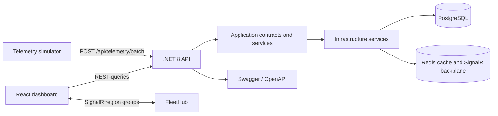

# Real-Time Operations & Analytics Dashboard

A production-oriented fleet operations monitor built with .NET 8, PostgreSQL, Redis, SignalR, React, TypeScript, Recharts, Polly, and k6.

The system simulates a connected fleet of vehicles reporting location and engine telemetry. Operators get a live fleet overview, region-scoped real-time updates, threshold alerts, historical vehicle detail, and aggregate performance metrics.

## Highlights

- Batched telemetry ingestion with configurable simulator volume and cadence
- PostgreSQL persistence through EF Core and Npgsql
- Compiled latest-status query, no-tracking reads, and split-query vehicle detail
- Redis cache-aside for short-lived fleet summaries
- SignalR region groups with Redis backplane support
- Server-side per-vehicle update throttling at approximately one update per second
- Threshold alerts for engine overheating and low fuel
- Polly retry and circuit-breaker policies for summary database and Redis operations
- React command-center dashboard with typed REST and SignalR clients
- k6 workloads for REST baselines and 100-to-500 SignalR connection tests
- Docker Compose development environment for PostgreSQL and Redis

## Architecture



### Runtime responsibilities

| Component | Responsibility |
| --- | --- |
| `src/Domain` | Vehicle, telemetry, alert entities, enums, and domain events |
| `src/Application` | DTOs and interfaces shared across transport and infrastructure |
| `src/Infrastructure` | EF Core context, mappings, migrations, query services, Redis cache, Polly policies |
| `src/Api` | Minimal API endpoints, SignalR hub, dependency injection, CORS, Swagger |
| `simulator` | Realistic batched telemetry producer |
| `dashboard` | Operator-facing React and TypeScript experience |
| `loadtests` | k6 REST and SignalR workloads plus ignored result output |
| `tests/Domain.Tests` | Focused domain behavior tests |

## Prerequisites

- .NET 8 SDK
- Node.js 20 or newer
- Docker Desktop with the Linux engine enabled
- PowerShell on Windows, or equivalent shell commands on other platforms
- Optional: k6, or Docker to run the k6 image without installing it locally

## Quick Start

### 1. Start PostgreSQL and Redis

From the repository root:

```powershell
docker compose up -d postgres redis
```

The Compose services expose:

| Service | Address | Default credentials |
| --- | --- | --- |
| PostgreSQL | `localhost:5432` | database/user/password: `ops_dashboard` |
| Redis | `localhost:6379` | no password |

### 2. Restore, migrate, build, and test

```powershell
dotnet restore OpsDashboard.slnx
dotnet ef database update --project src/Infrastructure --startup-project src/Infrastructure
dotnet build OpsDashboard.slnx
dotnet test tests/Domain.Tests/OpsDashboard.Domain.Tests.csproj
```

The design-time factory uses the same local PostgreSQL defaults as Compose. Runtime configuration is read from `src/Api/appsettings.json` and can be overridden with standard ASP.NET Core configuration providers.

### 3. Configure local secrets and start the API

Set an API key before starting the backend. The key is required for fleet endpoints and SignalR traffic.

```powershell
$env:OPS_API_KEY = "dev-local-api-key-change-me"
dotnet run --project src/Api --urls http://localhost:5000
```

The API is available at `http://localhost:5000`. Swagger UI is available at `http://localhost:5000/swagger` and the health endpoint is `http://localhost:5000/health`.

### 4. Start the simulator

In a second terminal:

```powershell
$env:OPS_API_URL = "http://localhost:5000"
$env:OPS_API_KEY = "dev-local-api-key-change-me"
$env:VEHICLE_COUNT = "50"
$env:INTERVAL_SECONDS = "2"
dotnet run --project simulator/OpsDashboard.Simulator.csproj
```

The simulator supports 1 to 200 vehicles. It posts one reading per vehicle as a batch and stops cleanly with `Ctrl+C`.

### 5. Start the dashboard

In a third terminal:

```powershell
Set-Location dashboard
$env:VITE_API_URL = "http://localhost:5000"
$env:VITE_API_KEY = "dev-local-api-key-change-me"
$env:VITE_ENABLE_DEMO_DATA = "false"
npm install
npm run dev
```

Open `http://127.0.0.1:5173/`. The dashboard displays an explicit offline snapshot if the API is unavailable; it switches to live fleet data when the API and SignalR hub are reachable.

## API Contract

All API responses use ISO 8601 timestamps and string enum values.

| Method | Route | Purpose |
| --- | --- | --- |
| `GET` | `/health` | Liveness check |
| `POST` | `/api/telemetry/batch` | Accept up to 1,000 telemetry readings |
| `GET` | `/api/fleet/status` | Latest status for every vehicle; optimized path by default |
| `GET` | `/api/fleet/status?mode=naive` | Preserved N+1 comparison path for benchmarking |
| `GET` | `/api/fleet/{externalId}` | Recent telemetry history and alerts for one vehicle |
| `GET` | `/api/fleet/summary` | Short-TTL cached aggregate fleet metrics |
| `GET` | `/api/alerts?limit=20` | Newest threshold alerts, bounded to 100 results |

The ingestion service creates or updates vehicles, appends telemetry, and creates one active alert per vehicle and threshold code. Current thresholds are:

- `engine-overheat`: engine temperature at or above `105 C`
- `low-fuel`: fuel at or below `15 percent`

## SignalR Contract

Hub URL: `http://localhost:5000/hubs/fleet`

Clients use the typed wrapper in `dashboard/src/hooks/useSignalRConnection.ts`. The wrapper enables automatic reconnect and subscribes to a region after connection:

```text
SubscribeRegion("North")
UnsubscribeRegion("North")
```

The server publishes `telemetryUpdated` events to the matching region group. The Redis backplane allows multiple API instances to share group messages. A per-vehicle semaphore and timestamp gate prevent a client group from receiving more than approximately one update per second per entity.

## Data and Resilience Design

### PostgreSQL and EF Core

- Telemetry is append-only history linked to a vehicle.
- Vehicle, telemetry, and alert indexes support latest status, recent history, and unresolved alert reads.
- The optimized latest-status path uses `EF.CompileAsyncQuery` and `AsNoTracking`.
- Vehicle detail uses `AsNoTracking` and `AsSplitQuery` to avoid cartesian expansion across telemetry and alert collections.
- The naive latest-status path remains available solely for before/after comparisons.

### Redis cache-aside

Only fleet-wide aggregates are cached with a five-second TTL. Raw per-vehicle state is deliberately not cached because it is already delivered through SignalR; caching it would add invalidation complexity without improving freshness.

Redis operations have bounded StackExchange.Redis timeouts, Polly retry/circuit-breaker policies, and exception handling that falls back to PostgreSQL for fleet summaries. A Redis outage must not make the summary endpoint crash or serve stale per-device state as if it were live.

### CORS and local development

The API allows the two local Vite origins:

- `http://localhost:5173`
- `http://127.0.0.1:5173`

For another frontend origin, update the `Dashboard` CORS policy in `src/Api/Program.cs` rather than enabling unrestricted origins.

## Load Testing

### REST comparison

The baseline workload exercises batched ingestion, fleet status, and fleet summary reads. It can select either query path:

```powershell
# Installed k6
$env:API_URL = "http://localhost:5000"
$env:STATUS_MODE = "naive"
$env:RESULT_FILE = "loadtests/results/naive-summary.json"
k6 run loadtests/baseline.js

$env:STATUS_MODE = "optimized"
$env:RESULT_FILE = "loadtests/results/optimized-summary.json"
k6 run loadtests/baseline.js
```

For short local comparisons, override `RAMP_DURATION`, `STEADY_DURATION`, and `BASELINE_VUS`. The default workload is intentionally longer for more stable measurements.

### SignalR scale test

`loadtests/signalr.js` negotiates SignalR connections, opens WebSockets, and subscribes clients to the North region group. It ramps from 100 connections to the value of `TARGET_VUS`, which defaults to 500:

```powershell
$env:API_URL = "http://localhost:5000"
$env:TARGET_VUS = "500"
$env:RESULT_FILE = "loadtests/results/signalr-summary.json"
k6 run loadtests/signalr.js
```

### Docker k6 runner

When k6 is not installed locally:

```powershell
$repo = (Get-Location).Path
docker run --rm `
  -e API_URL=http://host.docker.internal:5000 `
  -e STATUS_MODE=optimized `
  -e RESULT_FILE=/results/optimized-summary.json `
  -v "$repo/loadtests:/scripts" `
  -v "$repo/loadtests/results:/results" `
  grafana/k6:latest run /scripts/baseline.js
```

Generated JSON files under `loadtests/results` are ignored by Git. The scripts themselves remain versioned and reproducible.

## Recorded Measurements

These measurements were captured locally on 2026-09-21 using Docker-backed PostgreSQL/Redis, 50 vehicles, 10 k6 VUs, and a 60-second run per query mode. Values are p95 latency in milliseconds.

| Optimization | Before | After | Notes |
| --- | ---: | ---: | --- |
| Compiled latest-status query | `449.85 ms` | `287.65 ms` | Naive versus compiled path; same API and workload |
| Fleet summary cache path | `86.71 ms` warm p95 | `125.01 ms` warm p95 | Warm-cache observations; not a cold-cache comparison |
| Redis outage fallback | `7,287 ms` single request | `3,067 ms` single request | After bounded cache-operation timeouts; returned DB data in both checks |
| SignalR group filtering versus broadcast | Pending | Pending | Run `loadtests/signalr.js` at 100 and 500 VUs |

These numbers are local reference points, not production capacity claims. Hardware, Docker resource limits, database size, network placement, and simulator load all affect results.

## Verification Commands

```powershell
# Backend
dotnet build OpsDashboard.slnx --no-restore
dotnet test tests/Domain.Tests/OpsDashboard.Domain.Tests.csproj --no-restore

# Frontend
Set-Location dashboard
npm run lint
npm run build

# Script syntax without k6
Set-Location ..
node --check loadtests/baseline.js
node --check loadtests/signalr.js
```

## Troubleshooting

### Docker cannot connect to the engine

Start Docker Desktop and confirm the Linux engine is running:

```powershell
docker info
docker compose up -d postgres redis
```

### Migration cannot connect to PostgreSQL

Confirm the container is healthy and port `5432` is not occupied by another PostgreSQL instance:

```powershell
docker compose ps
docker compose logs postgres
```

### Dashboard shows Offline mode

Confirm the API is running on port 5000, the dashboard uses `VITE_API_URL=http://localhost:5000`, and the API CORS policy includes the exact browser origin. The dashboard intentionally keeps showing a labeled snapshot when REST or SignalR cannot connect.

### Redis is unavailable

The fleet summary should fall back to PostgreSQL. Check API logs for the Redis warning and verify that PostgreSQL remains available. SignalR group delivery will be unavailable until Redis returns, but the REST read path should remain usable.

## Design Decisions

See [docs/decisions.md](docs/decisions.md) for the rationale behind PostgreSQL, EF Core query choices, cache scope, SignalR groups, and resilience behavior. See [docs/architecture.md](docs/architecture.md) for the component diagram.
