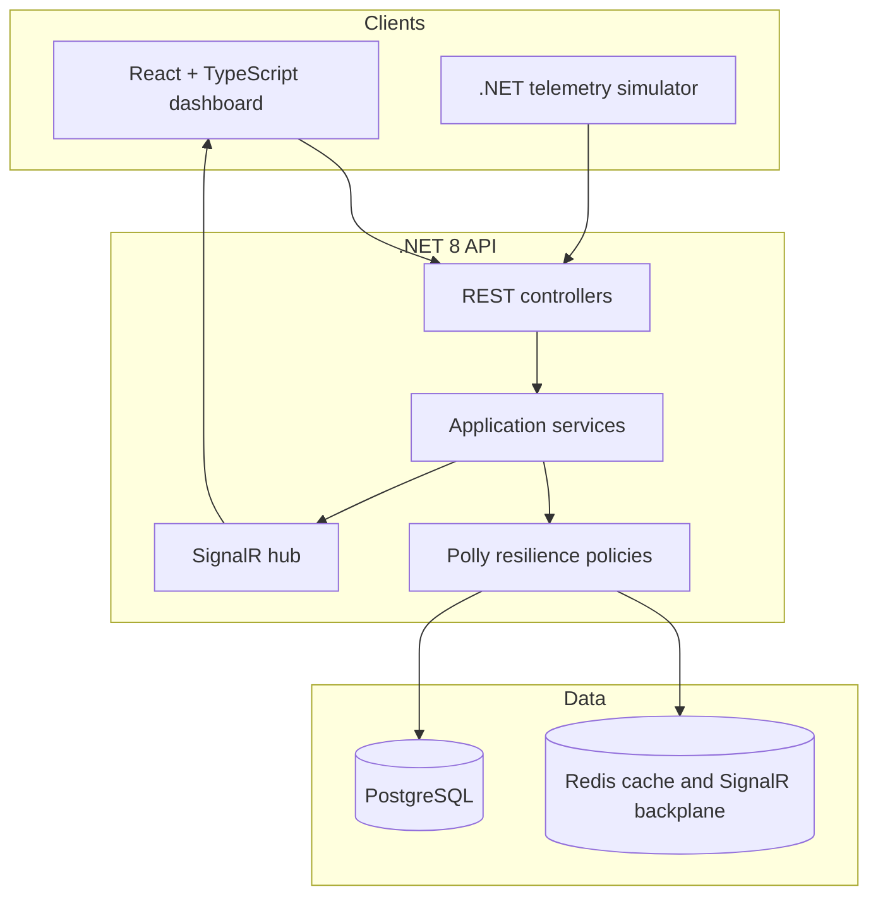

# Architecture

The first implementation slice currently contains the Domain and Infrastructure portions of this design. The remaining boxes are introduced in the order documented in the root README.